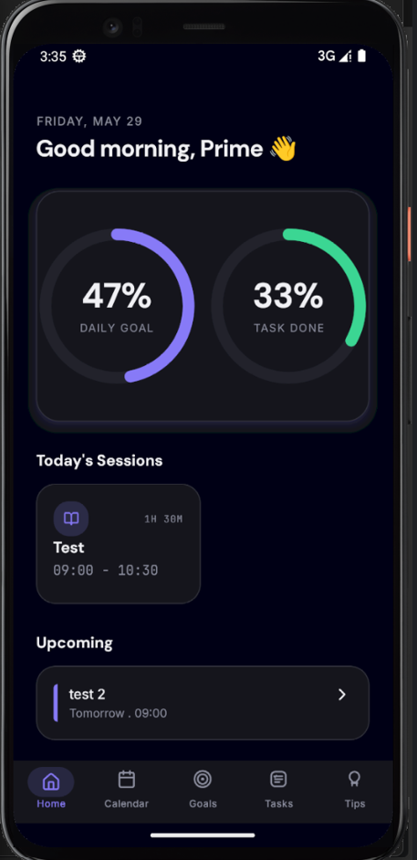
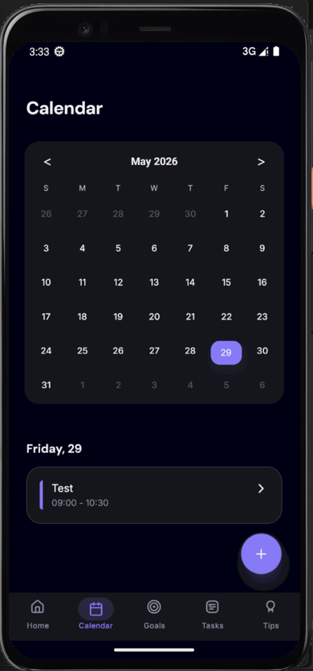
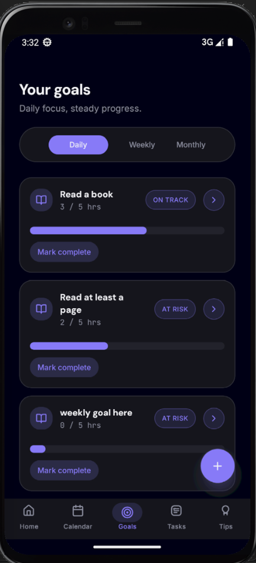
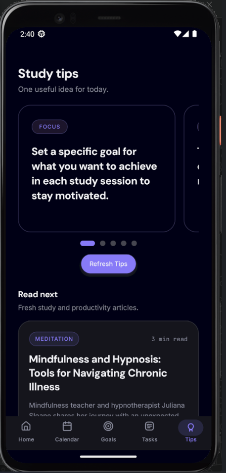
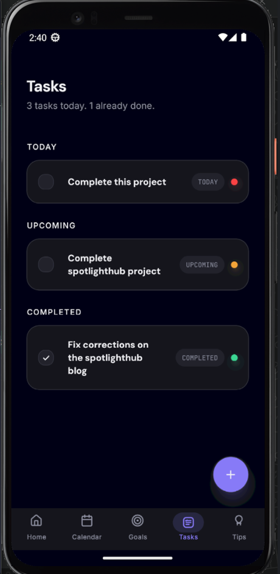

# Agendify

Agendify is a student productivity app built with Expo, React Native, and TypeScript. It helps users track study goals, manage tasks, plan sessions, stay on schedule with reminders, and get study tips powered by Groq.

## Features

- **Authentication and onboarding** - users sign in or sign up with email and password, then add their name for a personalized greeting.
- **Home dashboard** - shows the current date, greeting, goal progress, task progress, today’s sessions, and upcoming sessions.
- **Goals** - create and manage daily, weekly, and monthly goals with progress tracking and completion state.
- **Tasks** - organize tasks by section, mark them complete, and keep track of what still needs attention.
- **Calendar** - view planned sessions by date and quickly jump into a specific day.
- **Study sessions** - create session entries, review session details, and open them from reminders or detail views.
- **Notifications** - local reminders are scheduled for goals, tasks, and sessions.
- **Tips** - fetch AI-generated study tips from Groq and show study takeaways from blog content.

## Tech Stack

- Expo SDK 54
- Expo Router v6
- React Native
- TypeScript
- Zustand + Sqlite
- react-hook-form + zod
- date-fns
- expo-notifications
- Firebase Auth
- Groq API

## Project Structure

```text
app/                 Expo Router screens and route groups
components/          Shared UI components
src/components/      Feature components
src/lib/             App utilities and business logic
src/store/           Zustand stores
src/types/           Shared TypeScript types
src/validation/      Zod schemas
assets/              Images and fonts
```

## Getting Started

### Prerequisites

- Node.js
- npm
- EAS CLI
- Android Studio emulator or a physical device

### Install dependencies

```bash
npm install
```

### Start the app locally

```bash
npx expo start
```

### Build a preview APK

```bash
eas build --platform android --profile preview
```

## Environment Variables

The app expects a Groq API key at build time.

Set one of these in your EAS environment:

- `GROQ_API_KEY`
- `EXPO_PUBLIC_GROQ_API_KEY`

The `preview` build profile is tied to the `preview` EAS environment in [`eas.json`](./eas.json).

## Download
- **Android (APK):** [Download](https://github.com/Isaacayomi/Agendify/releases/download/v1.0.0/application-f6c479ad-03dc-4ee1-b6be-1716f85e847a.apk) — sideload directly on an Android device (enable "Install from unknown sources").
- **iOS Simulator build:** [Download](https://github.com/Isaacayomi/Agendify/releases/download/v1.0.0/application-54f21c40-9cb9-4eb6-84b2-30de851c13cc.tar.gz) — runs only in Xcode's iOS Simulator on macOS, not on a physical iPhone.

## Screenshots

### Home



### Calendar



### Goals



### Tips



### Tasks



## Notes

- Notification scheduling is handled centrally in `src/lib/notifications.ts`.
- Date formatting and date calculations go through `src/lib/date.ts`.
- App state is managed with Zustand and persisted using Sqlite.
